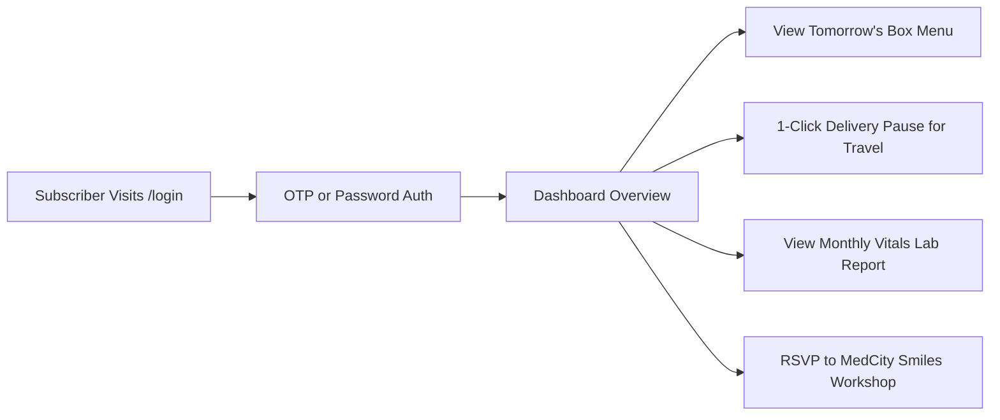

# HUMMING DROPS & MEDCITY SMILES — UI/UX DESIGN SPECIFICATION

**Document Version:** 1.0  
**Phase:** Phase 0 — Design Architecture  
**Status:** Authoritative UI/UX Design System Specification  

---

## 1. Brand Personality & Emotional Objectives

Humming Drops and MedCity Smiles exist at the intersection of daily physical vitality and holistic mental wellbeing. The visual design must reject generic, sterile healthcare tropes, fluorescent tech gradients, and template SaaS kits. Instead, it must embody an art-directed, organic, and deeply human character.

### Core Brand Attributes
1. **Fresh & Invigorating (Humming Drops):**
   * *Visual Expression:* Crisp botanical greens, dew-kissed produce photography, natural daylight aesthetics, and vibrant fruit accents.
   * *Feeling:* Like opening your door in the morning to crisp fresh air and meticulously prepared, high-quality produce.
2. **Calm, Empathetic & Grounded (MedCity Smiles):**
   * *Visual Expression:* Deep restorative teals, soft sage and mint surfaces, generous whitespace, and serene organic curves.
   * *Feeling:* A deep, cleansing exhale; a safe, judgment-free space to cultivate emotional clarity and self-compassion.
3. **Playful Yet Mature:**
   * *Visual Expression:* The friendly hummingbird emblem and smiling leaf-droplet icon paired with disciplined typography, elegant spacing, and structured layouts. Not childish or cartoonish, but warm and joyful.
4. **Uncompromisingly Premium & Trustworthy:**
   * *Visual Expression:* Flawless alignment, subtle 1px border rules, high contrast for supreme legibility, and clinical authority from MedCity Labs without cold hospital sterility.

---

## 2. Color System & Contrast Ratios

All color pairings are mathematically verified to satisfy **WCAG 2.1 Level AA** standards (minimum contrast 4.5:1 for normal body copy, 3.0:1 for large display titles) and **Level AAA** wherever possible.

### 2.1 Humming Drops Palette (Verdant Botanical / Morning Harvest)

```css
:root[data-theme="humming"] {
  /* Brand Primaries */
  --hd-primary-dark: #144518;      /* Deep Forest Green (Logo Lettering) - Contrast 9.8:1 on #FDFCF7 */
  --hd-primary-base: #1b5e20;      /* Rich Verdant Green */
  --hd-primary-light: #2e7301;     /* Fresh Leaf Green (Logo Leaves) */
  --hd-primary-subtle: #eaf5e9;    /* Morning Dew Tint */

  /* Neutral Backgrounds & Canvas */
  --hd-bg-canvas: #fdfcf7;         /* Warm Morning Cream (Soft organic paper tone) */
  --hd-bg-surface: #ffffff;        /* Pure White Card Fill */
  --hd-bg-muted: #f4f6f0;          /* Soft Alabaster for secondary section alternating */

  /* Text & Typography */
  --hd-text-primary: #122315;      /* Deep Charcoal Forest - Contrast 14.1:1 on #FDFCF7 */
  --hd-text-secondary: #3d5240;    /* Muted Moss Gray - Contrast 6.8:1 on #FDFCF7 */
  --hd-text-tertiary: #607864;     /* Accessible Caption Gray - Contrast 4.6:1 on #FDFCF7 */

  /* Produce & Nutritional Accents */
  --hd-accent-citrus: #e86a17;     /* Warm Papaya / Carrot Orange */
  --hd-accent-berry: #c53030;      /* Ripe Strawberry / Pomegranate Red */
  --hd-accent-sprout: #65a30d;     /* High-Protein Sprout Green */
  --hd-accent-walnut: #854d0e;     /* Nutritious Dry Fruit Amber */

  /* Borders & Dividers */
  --hd-border-subtle: #e2e8df;     /* 1px Card Outline */
  --hd-border-strong: #c2cfbe;     /* Input Active Outline */
}
```

### 2.2 MedCity Smiles Palette (Mindful Serenity / Preventative Care)

```css
:root[data-theme="medcity"] {
  /* Brand Primaries */
  --ms-primary-dark: #0d5049;      /* Deep Pine Teal (MedCity Smiles Logo) - Contrast 9.2:1 on #F8FAF9 */
  --ms-primary-base: #156c63;      /* Mindful Teal */
  --ms-primary-light: #209185;     /* Uplifting Sea Green */
  --ms-primary-subtle: #e6f7f5;    /* Soothing Mint Tint */

  /* Neutral Backgrounds & Canvas */
  --ms-bg-canvas: #f8faf9;         /* Serene Mist Canvas */
  --ms-bg-surface: #ffffff;        /* Crisp White Surface */
  --ms-bg-muted: #eef5f4;          /* Soft Glacier Gray */

  /* Text & Typography */
  --ms-text-primary: #0f2b27;      /* Deep Teal Black - Contrast 13.9:1 on #F8FAF9 */
  --ms-text-secondary: #335954;    /* Slate Teal - Contrast 6.5:1 on #F8FAF9 */
  --ms-text-tertiary: #527a75;     /* Accessible Muted Teal - Contrast 4.7:1 on #F8FAF9 */

  /* Mindful & Clinical Accents */
  --ms-accent-sunshine: #d97706;   /* Optimism & Positive Self-Talk Ochre */
  --ms-accent-vital: #0284c7;      /* Clinical Precision Sky Blue */
  --ms-accent-heart: #e11d48;      /* Vital BP Pulse Rose */

  /* Borders & Dividers */
  --ms-border-subtle: #dbe7e5;
  --ms-border-strong: #b5cdc9;
}
```

### 2.3 Semantic System States (Universal)
* **Success:** Base `#15803d` (Emerald 700), Background `#f0fdf4`, Border `#bbf7d0`.
* **Warning:** Base `#b45309` (Amber 700), Background `#fffbeb`, Border `#fde68a`.
* **Error / Alert:** Base `#b91c1c` (Red 700), Background `#fef2f2`, Border `#fecaca`.
* **Info:** Base `#0369a1` (Sky 700), Background `#f0f9ff`, Border `#bae6fd`.

---

## 3. Typography System & Type Scale

We select **Plus Jakarta Sans** as our primary display and interface typeface, paired with **Inter** for dense transactional UI (tables, pricing digits, forms).

### Type Hierarchy
| Level | Font Family | Size (Desktop) | Size (Mobile) | Weight | Line Height | Tracking | Purpose |
| :--- | :--- | :--- | :--- | :--- | :--- | :--- | :--- |
| **Hero Display** | Plus Jakarta Sans | 56px (`3.5rem`) | 36px (`2.25rem`) | 800 (ExtraBold) | 1.1 | `-0.03em` | Primary homepage headline |
| **Section H1** | Plus Jakarta Sans | 40px (`2.5rem`) | 28px (`1.75rem`) | 700 (Bold) | 1.2 | `-0.02em` | Major page section titles |
| **Section H2** | Plus Jakarta Sans | 28px (`1.75rem`) | 22px (`1.375rem`)| 700 (Bold) | 1.25| `-0.015em`| Card group & feature headers |
| **H3 / Card Title**| Plus Jakarta Sans | 20px (`1.25rem`) | 18px (`1.125rem`)| 600 (SemiBold) | 1.35| `0` | Pricing cards, anatomy cards |
| **Body Large** | Plus Jakarta Sans | 18px (`1.125rem`)| 16px (`1.0rem`) | 400 (Regular) | 1.6 | `0` | Lead introductory paragraphs |
| **Body Base** | Inter | 16px (`1.0rem`) | 15px (`0.9375rem`)| 400 (Regular) | 1.6 | `0` | Standard copy, explanations |
| **Body Small** | Inter | 14px (`0.875rem`)| 13px (`0.8125rem`)| 400 / 500 | 1.5 | `0` | Captions, metadata, disclaimer |
| **CTA / Button** | Plus Jakarta Sans | 15px (`0.9375rem`)| 15px (`0.9375rem`)| 600 (SemiBold) | 1.0 | `0.01em` | Action buttons, tabs, pills |
| **Price Hero** | Inter | 44px (`2.75rem`) | 36px (`2.25rem`) | 800 (ExtraBold) | 1.0 | `-0.03em` | ₹3,500 & ₹4,000 displays |

---

## 4. Spacing, Layout Grids & Structural Containers

### 4.1 Spacing Scale
* `4px` (`space-1`): Micro offsets, badge internal padding.
* `8px` (`space-2`): Icon-to-text spacing, input vertical padding.
* `12px` (`space-3`): Compact card padding, form field gaps.
* `16px` (`space-4`): Standard button padding, grid gutters on mobile.
* `24px` (`space-6`): Card interior padding, column gutters on tablet.
* `32px` (`space-8`): Section sub-block separation, modal padding.
* `48px` (`space-12`): Desktop grid gaps, standard section whitespace.
* `80px` (`space-20`): Standard vertical padding for desktop sections (`py-20`).
* `112px` (`space-28`): Hero and final CTA generous breathing room (`py-28`).

### 4.2 Containers & Layout Limits
* **Maximum Content Width:** `1280px` (`max-w-7xl mx-auto px-4 sm:px-6 lg:px-8`).
* **Reading Width Constraint:** `680px` (`max-w-2xl`) for narrative copy to guarantee < 75 characters per line.
* **Form & Checkout Width:** `600px` (`max-w-xl mx-auto`) for centered, distraction-free conversion.

---

## 5. Dual Visual Languages: Side-by-Side Comparison

Humming Drops and MedCity Smiles share structural components (buttons, nav, cards, grids) but project distinct atmospheres through token shifts.

| Design Attribute | Humming Drops (Physical Nutrition) | MedCity Smiles (Mental & Community) |
| :--- | :--- | :--- |
| **Dominant Canvas** | `#FDFCF7` (Warm Morning Cream) | `#F8FAF9` (Serene Mist) |
| **Primary Brand Token**| `#144518` (Botanical Forest Green) | `#156C63` (Restorative Mindful Teal) |
| **Accent Tone** | `#E86A17` (Sun Papaya) & `#2E7301` (Fresh Leaf) | `#D97706` (Mindful Ochre) & `#0284C7` (Lab Blue) |
| **Hero Imagery Style** | Meticulously prepared fresh food boxes, dew drops, morning light | Warm smiling human community, mindful movement, doctors & seminars |
| **Section Transitions** | Crisp 1px organic borders, subtle paper shifts | Soothing curved SVG waves, soft mist gradients |
| **Badge Treatment** | Pale green pill: `bg-[#EAF5E9] text-[#144518]` | Pale mint pill: `bg-[#E6F7F5] text-[#0D5049]` |
| **Button Primary** | Forest Green with crisp white text | Mindful Teal with crisp white text |
| **Tone of Voice** | Crisp, energizing, habit-forming, nutritious | Gentle, reassuring, destigmatizing, empowering |

---

## 6. Core Component Specifications

### 6.1 Persistent Brand Switcher (Header)
* **Structure:** A pill-shaped segmented toggle nestled in the global navigation bar.
* **Options:**
  1. `[ 🥗 Humming Drops · Physical Wellness ]`
  2. `[ 💚 MedCity Smiles · Mental Wellbeing ]`
* **Interaction:** Clicking smoothly animates an active white sliding pill behind the selected label (`layoutId="brandPill"` via Framer Motion), updates the URL route (`/` or `/medcity-smiles`), and shifts the root CSS variables smoothly over 250ms.

### 6.2 The 5-Compartment Box Breakdown (Bento Grid)
* **Visual Representation:** An interactive layout built around the authentic meal box photo (`p1_4_X18.png`).
* **5 Interactive Compartment Cards (Confirmed Brochure Inclusions):**
  1. **4 Varieties of Fruits — Every Day** (Confirmed brochure inclusion; rotating seasonal varieties; [CLIENT INPUT REQUIRED: exact seasonal rotation per CIR-06]).
  2. **2 Varieties of Vegetables — Every Day** (Confirmed brochure inclusion; [CLIENT INPUT REQUIRED: daily vegetable varieties per CIR-06]).
  3. **Fresh Mix Salad — Every Day** (Confirmed brochure inclusion).
  4. **Fresh Sprouts — Every Day** (Confirmed brochure inclusion).
  5. **Dry Fruits:** Standard (3 days a week) vs. Premium (a nutritious serving every day).
  *(Note: Specific produce varieties visible in photographs are illustrative serving examples only, not contractual promises).*
* **Hover State:** Subtle elevation (`translateY(-4px)`), subtle accent border, and compartment description.

### 6.3 Subscription Plan Cards (Standard vs. Premium)
* **Standard Card (₹3,500/month):**
  * Clear daily anchor: `Just ₹116 / day`.
  * Inclusions list: 4 fruits, 2 veg, mix salad, sprouts, dry fruits (3 days/week), free MedCity Smiles membership, free monthly health checkup.
  * CTA: `Subscribe Standard`.
* **Premium Card (₹4,000/month):**
  * "RECOMMENDED" floating badge in warm forest gold.
  * Daily anchor: `Just ₹133 / day` (Only ₹17 more per day for complete daily dry fruits & juices).
  * Highlighted Additions: Daily Dry Fruits, Exclusive MedCity Labs package discounts, Special Healthy Juice Drops curated with CARE by Berrybeats.
  * CTA: `Subscribe Premium` (High-contrast Forest Green button).

### 6.4 Free Monthly Health Checkup Section (Sugar, Cholesterol, BP)
* **Visual Card:** Clean card layout displaying the three free monthly checkups explicitly confirmed on Page 3 and Page 6 of the brochure:
  - **Item 1: Blood Sugar**
  - **Item 2: Cholesterol**
  - **Item 3: Blood Pressure**
* **Partner Attribution:** Confirmed brochure statements: "In collaboration with MedCity Health Labs" and "A community of experts to monitor your vitals".
* **Visual Design Direction:** Warm, approachable, and destigmatizing visual styling (avoiding cold hospital sterility). Strictly avoids unconfirmed clinical claims or physiological outcome promises.

### 6.5 Interactive Multi-Step Onboarding Modal / Page
* **Step Header:** Progress tracker with numbered circle chips and active line fill.
* **Step 1:** Plan confirmation with toggle (Standard ₹3,500 vs. Premium ₹4,000).
* **Step 2:** Profile inputs (Full Name, Phone with `+91` prefix, Email).
* **Step 3:** Delivery address (Bangalore address: Flat, Building, Street, Area, Pincode, optional delivery instructions/timing note; delivery hours strictly provisional per `CIR-01` & `CIR-02`).
* **Step 4:** Dietary and allergen preferences (Customized notes without rigid database constraints; `CIR-06`).
* **Step 5:** Itemized summary with zero delivery charges and **Pluggable Fulfillment Action** (`CIR-07`):
  * *Option A (Gateway Mode):* "Proceed to Secure Payment" launching Razorpay modal.
  * *Option B (Assisted Mode):* "Submit Subscription Request" generating reference ID and opening direct WhatsApp chat with Humming Drops Bangalore team (`8618902810`).

---

## 7. UX Flows & Decision Architecture

### 7.1 New Visitor to First-Time Subscriber Flow
```mermaid
flowchart TD
    A[Visitor Lands on /] --> B{Explores Concept}
    B -->|Wants Food & Nutrition| C[Reviews 5-Compartment Box Anatomy]
    B -->|Curious About Mental Health| D[Switches to /medcity-smiles]
    D --> E[Discovers Holistic Mind-Body Pillars & Free Vitals Check]
    E --> F[Selects Plan: Standard vs Premium]
    C --> F
    F --> G[/subscribe Step 1: Confirm Plan]
    G --> H[Step 2: Name, Phone & Email]
    H --> I[Step 3: Bangalore Delivery Address & Notes]
    I --> J[Step 4: Dietary & Allergen Notes]
    J --> K[Step 5: Review & Pluggable Fulfillment]
    K -->|Mode A: Online Gateway| L1[Razorpay Payment Modal]
    L1 --> M1[Instant Payment Success & Dashboard Access]
    K -->|Mode B: Assisted Lead| L2[Generate Ref Code & Open WhatsApp 8618902810]
    L2 --> M2[Request Received & Manual Team Follow-up]
```

### 7.2 Returning Subscriber Daily Management Flow


---

## 8. Responsive Design & Viewport Rules

* **Mobile (320px – 639px):**
  * Global navigation condenses into a clean sticky header: Logo + Hamburger toggle only.
  * Brand switcher, full navigation links, and primary/secondary CTAs reside inside the accessible slide-down drawer.
  * Hero stacks vertically: Headline → Primary CTA → Box centerpiece imagery.
  * Pricing cards stack vertically with Premium plan highlighted.
  * Sticky bottom action bar on mobile checkout flow.
* **Tablet & Compact Viewports (640px – 1279px, including 768px):**
  * Header layout: Brand Logo (left) + Centered Brand Switcher + Primary Brand CTA button (right) + Hamburger drawer toggle.
  * Desktop navigation links are tucked away into the slide-down drawer below `xl:` (1280px) to prevent squeezed header overcrowding and horizontal overflow.
  * When drawer opens at 768px, navigation links and secondary "Sign In" CTA are cleanly accessible, while duplicate brand switcher is suppressed (`sm:hidden`) because it is already visible in the top bar.
  * 2-column feature grids (`md:grid-cols-2`).
  * Box anatomy displays in a balanced 2-column grid.
* **Desktop (1280px – 1535px, `xl`):**
  * Full top-level navigation links visible alongside Centered Brand Switcher, Logo, "Sign In" ghost button, and Primary Brand CTA.
  * Hamburger toggle is hidden.
  * Dual-column heroes with side-by-side copy and produce composition.
* **Ultra-wide (>=1536px, `2xl`):**
  * Layout remains firmly centered within `max-w-7xl` to prevent uncomfortably long line lengths or detached UI controls.
  * Brand switcher displays expanded descriptive badges (`· Physical` / `· Mental & Labs`).

---

## 9. Accessibility (WCAG 2.1 AA) Compliance Checklist

1. **Color Perception:** No information is conveyed by color alone. Every status (active, paused, success, warning) is paired with a clear text label and distinct icon.
2. **Keyboard Focus:** All interactive controls display a 2px offset focus ring (`focus-visible:ring-2 focus-visible:ring-offset-2 focus-visible:ring-brand-primary`).
3. **Screen Reader Landmarks:** Proper semantic structure using `<header>`, `<nav aria-label="Main Navigation">`, `<main id="main-content">`, `<section aria-labelledby="...">`, and `<footer>`.
4. **Form Field Accessibility:** All form inputs have explicit `<label htmlFor="...">` tags and `aria-invalid` / `aria-describedby` associations for real-time error announcements.
5. **Reduced Motion:** All Framer Motion variants and CSS transitions respect `prefers-reduced-motion: reduce`, defaulting to instant opacity cuts without physical displacement.

---

## 10. Reference Website Analysis & Dual-Brand Visual Direction

This section documents the visual and editorial design principles extracted from three client-designated reference platforms (`eatwholy.com`, `headspace.com`, and `goodinside.com`). It translates these principles into two distinct, original experiences for **Humming Drops** and **MedCity Smiles** while strictly preserving client-confirmed facts and forbidding copyright infringement.

### 10.1 Multi-Dimensional Analysis of Reference Websites

```text
┌─────────────────────────────────────────────────────────────────────────────────────────────┐
│                                REFERENCE BENCHMARK MATRIX                                   │
├──────────────────────┬──────────────────────────┬──────────────────────────┬────────────────┤
│ Dimension            │ Eat Wholy (eatwholy.com) │ Headspace (headspace.com)│ Good Inside    │
├──────────────────────┼──────────────────────────┼──────────────────────────┼────────────────┤
│ Brand Category       │ D2C Fresh Food / Veggies │ Mental Health / CalmMind │ Community/Life │
│ Core Emotion         │ Energetic, Fresh, Tasty  │ Restorative, Safe, Calm  │ Wise, Empathetic│
│ Dominant Geometry    │ Soft Organic Pills (24px)│ Gentle Curves & Ovals    │ Structured/Warm│
│ Imagery Style        │ High-res Produce Cutouts │ Warm Human + Soft Art    │ Candid Humans  │
│ Pacing / Whitespace  │ Punchy, High Rhythm      │ Expansive, Deep Breath   │ Editorial/Story│
│ Headline Voice       │ Bold, Ingredient Truth   │ Reassuring, Gentle       │ Conversational │
└──────────────────────┴──────────────────────────┴──────────────────────────┴────────────────┘
```

#### Detailed Breakdown Across 15 Core Criteria:

1. **Visual Hierarchy:**
   * *Eat Wholy:* Immediate sensory impact. High-contrast food cutouts and bold claims grab attention first, followed by nutritional proof badges and immediate shopping action.
   * *Headspace:* Gentle vertical deceleration. Soft, calm title draws the eye down to a warm illustration or peaceful human portrait, followed by a quiet invitation to start.
   * *Good Inside:* Editorial authority. Magazine-style headlines with pull quotes create an intimate, high-credibility dialogue before presenting workshops or membership.

2. **Editorial Composition:**
   * *Eat Wholy:* Transparent, proud, ingredient-first. No jargon; highlights percentages and real vegetables.
   * *Headspace:* Empathetic and destigmatizing. Speaks as a supportive companion, acknowledging stress without panic.
   * *Good Inside:* Clinical psychology translated into kitchen-table language. Honest, validating, and deeply relatable.

3. **Section Composition:**
   * *Eat Wholy:* Rhythmic alternating blocks (cream, vibrant green, sunny orange). High visual contrast keeps the scroll engaging and lively.
   * *Headspace:* Generous vertical paddings (96px–128px). Seamless tonal transitions between soothing sage, warm mist, and pale peach.
   * *Good Inside:* Asymmetrical editorial grids with featured case studies, pull quotes, and structured program cards.

4. **Use and Placement of Large Imagery:**
   * *Eat Wholy:* Large, cut-out fresh vegetables break through container boundaries and float over organic color fields, creating physical depth and tactile appetite appeal.
   * *Headspace:* Soft, naturally lit photography of diverse people resting, meditating, or enjoying quiet moments, integrated seamlessly with signature character art.
   * *Good Inside:* Candid, documentary-style photography of parents, children, and therapists in authentic emotional interactions; zero stock-photo cheese.

5. **Typography Scale and Hierarchy:**
   * *Eat Wholy:* Heavy, rounded display sans with tight negative tracking (`-0.02em`), paired with crisp, functional geometric body sans.
   * *Headspace:* Custom rounded humanist geometric sans with open counters, generous line-heights (1.6–1.8), and gentle weights that feel calming rather than aggressive.
   * *Good Inside:* Elegant editorial serif for titles conveying clinical authority and warmth, paired with a robust humanist sans for body reading.

6. **Whitespace and Pacing:**
   * *Eat Wholy:* Dynamic and rhythmic. Plentiful whitespace around big titles, paired with tight, energetic badge clusters.
   * *Headspace:* Expansive, therapeutic negative space that actively lowers cognitive load and slows the user's pulse.
   * *Good Inside:* Thoughtful editorial pacing that invites slow, reflective reading without intimidating walls of text.

7. **Rounded vs. Structured Geometry:**
   * *Eat Wholy:* Fully rounded pill shapes (`rounded-full`), organic 24px corner radii, circular photo frames, and soft pebble containers.
   * *Headspace:* Extra-soft organic geometry, pill buttons, floating cloud cards, and smooth curved section transitions.
   * *Good Inside:* Structured cards with softened corners (12px–16px radii), clean 1px hairline dividers, and refined rectangular framing.

8. **Cards and Content Blocks:**
   * *Eat Wholy:* Modular cards featuring ingredient icons, percentage badges, and clear benefit bullet points with warm container fills.
   * *Headspace:* Pastel-tinted cards with subtle 1px borders, session duration tags (e.g. "3 min", "10 min"), and play icons.
   * *Good Inside:* Workshop cards with topic badges, expert author attribution, reading times, and clear completion indicators.

9. **Illustrations, Doodles & Playful Details:**
   * *Eat Wholy:* Playful botanical stamps, hand-drawn vegetable doodles, smiling badges, and starburst accents that inject handcrafted joy.
   * *Headspace:* Iconic minimalist character illustrations that personify emotions (calm sun, sleepy cloud, curious bean) without feeling trivial.
   * *Good Inside:* Understated hand-drawn underlines, gentle highlighter marks, and friendly organic icon badges emphasizing key words.

10. **Animation and Micro-Interactions:**
    * *Eat Wholy:* Energetic hover lifts (`translateY(-4px)`), smooth pill morphing on tab switches, and lively button bounce.
    * *Headspace:* Slow, soothing easing curves (`cubic-bezier(0.16, 1, 0.3, 1)`), ambient breathing pulses, and gentle fade-ins.
    * *Good Inside:* Restrained, dignified transitions: smooth accordion dropdowns, subtle tab switches, and quiet hover elevations.

11. **Scroll-Based Storytelling:**
    * *Eat Wholy:* Appetite hook → Ingredient dissection → Nutritional proof → Social validation → Flavor picker / Cart.
    * *Headspace:* Stress acknowledgement → Gentle pause invitation → The 4 core pillars → Clinical proof → Free trial CTA.
    * *Good Inside:* Emotional validation → Mindset paradigm shift → Practical workshop tools → Community voices → Membership tier.

12. **CTA Treatment:**
    * *Eat Wholy:* High-contrast plump pill buttons with arrow icon nudges and bold, direct verbs ("Taste the Difference", "Shop Now").
    * *Headspace:* Inviting, low-pressure pill buttons in warm amber or calm teal ("Try for Free", "Start Listening").
    * *Good Inside:* Confident, clear buttons with strong contrast and reassuring copy ("Join Community", "Access Workshop").

13. **Navigation Behavior:**
    * *Eat Wholy:* Minimal, focused header with clear product categories and prominent primary action.
    * *Headspace:* Clean, distraction-free top bar with category links, quiet sign-in, and primary free trial button.
    * *Good Inside:* Sophisticated editorial menu with clear links to Workshops, Library, Community, and Member Login.

14. **Mobile Experience:**
    * *Eat Wholy:* Sticky bottom conversion bar, horizontal swipeable product decks, thumb-friendly 48px+ tap targets.
    * *Headspace:* Soothing bottom sheets, large tap controls for audio playback, gesture-friendly session cards.
    * *Good Inside:* Clean vertical reading hierarchy, collapsible filters, and distraction-free mobile reading view.

15. **Overall Emotional Tone & Identity Differentiation:**
    * *Eat Wholy:* Celebrates real, unadulterated food. Rejects artificial diet culture and corporate greenwashing.
    * *Headspace:* Creates an emotional sanctuary. Rejects clinical coldness, medical jargon, and chaotic tech urgency.
    * *Good Inside:* Cultivates deep human trust. Rejects generic influencer wellness advice in favor of grounded psychology.
    * *Crucial Takeaway:* **None of these sites look like a generic SaaS template.** They avoid neon gradient meshes, generic 3D corporate cubes, and sterile enterprise tables. Every element is rooted in their brand's physical or emotional reality.

---

### 10.2 Humming Drops Visual Direction (Physical Nutrition Homepage)

* **Mood & Essence:** Fresh, botanical, energetic, food-focused, premium yet approachable.
* **Core Metaphor:** Opening your doorstep in the morning to crisp fresh air and a meticulously prepared breakfast box.
* **Key Visual Principles for Implementation:**
  1. **Physical Box Centerpiece (The Hero):**
     * Prominently showcase the authentic Humming Drops morning box photograph (`p1_4_X18.png`), treated with crisp natural lighting, soft shadow drops, and subtle botanical leaf accents.
     * Accompany the visual with an immediate, honest headline: *"Healthy Drops, Healthier you"* and crisp introductory copy celebrating daily morning delivery of fresh cut fruits, vegetables, mix salad, and sprouts.
  2. **The 5-Compartment Bento Anatomy:**
     * Instead of generic bullet points, build an interactive 5-compartment visual breakdown reflecting the exact physical box confirmed on Page 4 of the brochure:
       - Compartment 1: 4 Varieties of Fruits — Every Day (Confirmed brochure inclusion; rotating seasonal varieties [CLIENT INPUT REQUIRED: exact seasonal rotation per CIR-06]).
       - Compartment 2: 2 Varieties of Vegetables — Every Day (Confirmed brochure inclusion [CLIENT INPUT REQUIRED: daily vegetable varieties per CIR-06]).
       - Compartment 3: Fresh Mix Salad — Every Day (Confirmed brochure inclusion).
       - Compartment 4: Fresh Sprouts — Every Day (Confirmed brochure inclusion).
       - Compartment 5: Dry Fruits (Confirmed brochure inclusion: 3 days a week on Standard, nutritious serving every day on Premium).
     * (Note: Any specific produce varieties shown in marketing imagery are illustrative serving examples only, not promised contractual items).
     * Use color-coded botanical micro-accents from our design tokens: Sun Papaya (`--hd-accent-citrus`), Ripe Berry (`--hd-accent-berry`), Living Sprout (`--hd-accent-sprout`), and Walnut Amber (`--hd-accent-walnut`).
  3. **Morning Ritual Scroll Journey:**
     * Section 1: Morning Delivery Hook & Box Centerpiece (Hero).
     * Section 2: What's Inside Your Daily Box (5-Compartment Bento breakdown).
     * Section 3: Why Fresh Morning Whole Foods? (Nutritional nourishment & morning habit formation per Page 2 of brochure).
     * Section 4: Transparent Subscription Pricing (Standard ₹3,500 vs. Premium ₹4,000 with per-day breakdown: ₹116/day vs ₹133/day).
     * Section 5: The Holistic Connection (Introduction to MedCity Smiles & free monthly health checkups).
     * Section 6: Kitchen & Hub Transparency (Prepared fresh at Berrybeats Cafe, Bangalore).
  4. **Geometry & Styling:**
     * Warm Morning Cream canvas (`#FDFCF7`), Crisp Botanical Green (`#144518` / `#1B5E20`), and subtle 1px border lines (`#E2E8DF`).
     * Soft pill badges (`rounded-full`), organic 20px–24px card corner radii (`rounded-2xl` to `rounded-3xl`), and tactile hover lifts (`translateY(-4px)`).

---

### 10.3 MedCity Smiles Visual Direction (Mental Wellbeing Homepage)

* **Mood & Essence:** Calm, restorative, warm, human, community-centered.
* **Core Metaphor:** A deep, cleansing exhale; a serene space where mental wellbeing, positive self-talk, and community connection are cultivated.
* **Key Visual Principles for Implementation:**
  1. **Serene Emotional Sanctuary (The Hero):**
     * Soft Serene Mist canvas (`#F8FAF9`) paired with Deep Pine Teal (`#0D5049`) and Soothing Mint surfaces (`#E6F7F5`).
     * Warm, welcoming headline: *"Nourishing the Body. Uplifting the Mind. Building a Happier Community."*
     * Natural, warm photography of smiling humans in reflective, mindful, or gentle community activities.
  2. **The 4 Confirmed Holistic Wellbeing Pillars (Sourced directly from Page 6 of the brochure):**
     * Visual 4-column / 2x2 grid representing the confirmed brochure pillars:
       - **Pillar 1: Fuel Your Brain:** Eating a balanced diet supports brain health and is key to a stable mood (direct from Page 6 of brochure).
       - **Pillar 2: Cultivate Positive Self-Talk:** Challenge negative thoughts and replace them with realistic, kind ones. Celebrate small achievements and progress. Be patient and compassionate with yourself.
       - **Pillar 3: Discover Your Happy-Healthy Coping Mechanisms:** Physical activities (exercise, yoga, deep breathing), mindfulness and meditation to stay present, creative outlets (art, music, writing) to express emotions.
       - **Pillar 4: Community Gatherings & Live Shares:** Practice these skills together in community gatherings, expert-led seminars, engaging classes, and joyful live sharing sessions.
  3. **Free Monthly Health Checkup Section (Sugar, Cholesterol, BP):**
     * Highlighting the free monthly checkup explicitly confirmed on Page 3 and Page 6 of the brochure:
       - 🩸 **Blood Sugar**
       - 🫀 **Cholesterol**
       - 🩺 **Blood Pressure**
     * Confirmed brochure attribution: *"In collaboration with MedCity Health Labs"* and *"A community of experts to monitor your vitals"*.
     * **Visual Design Direction:** Warm, approachable, and destigmatizing design treatment (inspired by Headspace's low-cognitive-load approach), avoiding cold hospital sterility while strictly avoiding unapproved medical claims or clinical guarantees.
  4. **Geometry & Pacing:**
     * Expansive vertical whitespace (`py-24` to `py-28`), relaxed body line-heights (1.65–1.75), and calm, pill-shaped badges.
     * Easing curves designed to feel unhurried, reassuring, and dignified.

---

### 10.4 Shared Design Principles & Universal Primitives

While the two experiences project distinctly different moods, they share a unified technical foundation:
1. **Symmetric Token Architecture:** Both brands utilize the identical CSS semantic variable keys (`--brand-primary`, `--brand-surface`, `--brand-subtle`, `--text-primary`, `--border-subtle`), ensuring full code reusability without style leaking.
2. **Accessible Foundations:** Strict adherence to WCAG 2.1 AA standards across both themes (contrast ratios >= 4.5:1 for body copy, >= 7:1 for headers, visible keyboard focus rings, reduced-motion fallbacks).
3. **Harmonious Typography:** Plus Jakarta Sans for bold, friendly headings and Inter for high-density transactional copy and pricing numerals.
4. **Organic, Non-Corporate Geometry:** Rounded pill containers, soft 16px–24px card radii, and gentle border hairlines that completely avoid cold corporate enterprise aesthetics.

---

### 10.5 Explicit Non-Infringement Guardrails (What Must NOT Be Copied)

To protect intellectual property and brand integrity, the following rules are strictly enforced:
* **DO NOT copy exact layouts, section sequences, or grid arrangements** from Eat Wholy, Headspace, or Good Inside.
* **DO NOT copy proprietary text, headlines, slogans, or body copy** from any reference website.
* **DO NOT copy character illustrations, mascots, custom doodles, or icons** (e.g. Headspace character faces, Good Inside illustrations).
* **DO NOT copy logos, trademarks, proprietary badges, or exact brand color codes** from the reference websites.
* **DO NOT copy proprietary animations, custom SVG paths, or private frontend widgets.**
* **Reference Role:** The references serve exclusively as benchmarks for **visual hierarchy, layout pacing, tactile geometry, and emotional tone**. All Humming Drops and MedCity Smiles designs, illustrations, copy, and code are 100% original and custom-built.

---

### 10.6 Content Protection & Client Factual Truth

All public-facing copy and structural sections must adhere strictly to the confirmed client brochure:
* **Confirmed Facts:** Daily 5-compartment box (4 fruits, 2 veg, mix salad, sprouts, dry fruits), Standard (₹3,500/mo) vs. Premium (₹4,000/mo), free MedCity Smiles membership, free monthly health checkup (Sugar, Cholesterol, BP), Berrybeats Cafe kitchen partnership, MedCity Labs collaboration.
* **Prohibited Inventions:** Do NOT invent customer testimonials, clinical cure claims, delivery corridor guarantees, regulatory certifications, or delivery hour commitments.
* **Provisional Items:** All unconfirmed operational details (specific delivery pincodes, exact morning time slots, 30-day continuous cycle definitions, phlebotomy logistics) remain documented as `CLIENT INPUT REQUIRED` rather than published as hard claims.

---

### 10.7 Implementation Roadmap for Upcoming Phases

| Phase | Target Scope | Key Visual Principles to Implement |
| :--- | :--- | :--- |
| **Phase 4** | Humming Drops Homepage | Food-first hero with authentic box imagery, interactive 5-compartment bento grid, morning habit timeline, transparent plan cards, Berrybeats kitchen trust badge. |
| **Phase 5** | MedCity Smiles Homepage | Serene mental wellbeing sanctuary, 4 holistic pillars grid, MedCity Labs preventative checkup card, community workshop preview, doctor advisory credibility. |
| **Phase 6** | Subscription Funnel | Pluggable multi-step onboarding (Standard vs. Premium), Bangalore address capture, dietary notes, toggleable checkout (Razorpay gateway vs. WhatsApp assisted lead). |
| **Phase 7+** | Auth, Dashboard & Portals | Protected subscriber dashboard, daily box calendar, pause delivery toggle, monthly vitals report viewer, community RSVP. |

