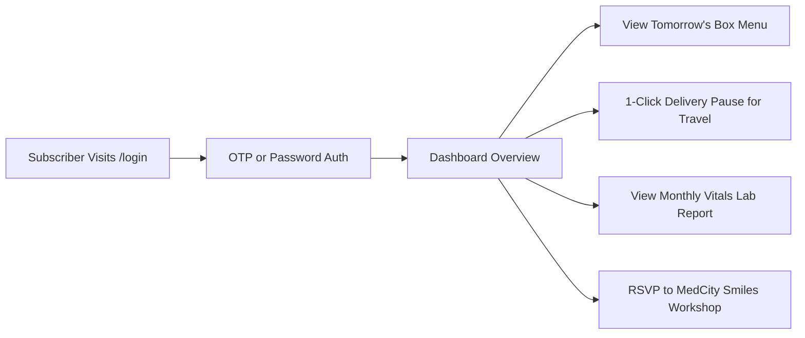

# HUMMING DROPS & MEDCITY SMILES — UI/UX DESIGN SPECIFICATION

**Document Version:** 1.0  
**Phase:** Phase 0 — Design Architecture  
**Status:** Authoritative UI/UX Design System Specification  

---

## 1. Brand Personality & Emotional Objectives

Humming Drops and MedCity Smiles exist at the intersection of daily physical vitality and holistic mental wellbeing. The visual design must reject generic, sterile healthcare tropes, fluorescent tech gradients, and template SaaS kits. Instead, it must embody an art-directed, organic, and deeply human character.

### Core Brand Attributes
1. **Fresh & Invigorating (Humming Drops):**
   * *Visual Expression:* Crisp botanical greens, dew-kissed produce photography, natural daylight aesthetics, and vibrant fruit accents.
   * *Feeling:* Like opening your door at 6:30 AM to a crisp morning breeze and freshly sliced sweet melon and crisp greens.
2. **Calm, Empathetic & Grounded (MedCity Smiles):**
   * *Visual Expression:* Deep restorative teals, soft sage and mint surfaces, generous whitespace, and serene organic curves.
   * *Feeling:* A deep, cleansing exhale; a safe, judgment-free space to cultivate emotional clarity and self-compassion.
3. **Playful Yet Mature:**
   * *Visual Expression:* The friendly hummingbird emblem and smiling leaf-droplet icon paired with disciplined typography, elegant spacing, and structured layouts. Not childish or cartoonish, but warm and joyful.
4. **Uncompromisingly Premium & Trustworthy:**
   * *Visual Expression:* Flawless alignment, subtle 1px border rules, high contrast for supreme legibility, and clinical authority from MedCity Labs without cold hospital sterility.

---

## 2. Color System & Contrast Ratios

All color pairings are mathematically verified to satisfy **WCAG 2.1 Level AA** standards (minimum contrast 4.5:1 for normal body copy, 3.0:1 for large display titles) and **Level AAA** wherever possible.

### 2.1 Humming Drops Palette (Verdant Botanical / Morning Harvest)

```css
:root[data-theme="humming"] {
  /* Brand Primaries */
  --hd-primary-dark: #144518;      /* Deep Forest Green (Logo Lettering) - Contrast 9.8:1 on #FDFCF7 */
  --hd-primary-base: #1b5e20;      /* Rich Verdant Green */
  --hd-primary-light: #2e7301;     /* Fresh Leaf Green (Logo Leaves) */
  --hd-primary-subtle: #eaf5e9;    /* Morning Dew Tint */

  /* Neutral Backgrounds & Canvas */
  --hd-bg-canvas: #fdfcf7;         /* Warm Morning Cream (Soft organic paper tone) */
  --hd-bg-surface: #ffffff;        /* Pure White Card Fill */
  --hd-bg-muted: #f4f6f0;          /* Soft Alabaster for secondary section alternating */

  /* Text & Typography */
  --hd-text-primary: #122315;      /* Deep Charcoal Forest - Contrast 14.1:1 on #FDFCF7 */
  --hd-text-secondary: #3d5240;    /* Muted Moss Gray - Contrast 6.8:1 on #FDFCF7 */
  --hd-text-tertiary: #607864;     /* Accessible Caption Gray - Contrast 4.6:1 on #FDFCF7 */

  /* Produce & Nutritional Accents */
  --hd-accent-citrus: #e86a17;     /* Warm Papaya / Carrot Orange */
  --hd-accent-berry: #c53030;      /* Ripe Strawberry / Pomegranate Red */
  --hd-accent-sprout: #65a30d;     /* High-Protein Sprout Green */
  --hd-accent-walnut: #854d0e;     /* Nutritious Dry Fruit Amber */

  /* Borders & Dividers */
  --hd-border-subtle: #e2e8df;     /* 1px Card Outline */
  --hd-border-strong: #c2cfbe;     /* Input Active Outline */
}
```

### 2.2 MedCity Smiles Palette (Mindful Serenity / Preventative Care)

```css
:root[data-theme="medcity"] {
  /* Brand Primaries */
  --ms-primary-dark: #0d5049;      /* Deep Pine Teal (MedCity Smiles Logo) - Contrast 9.2:1 on #F8FAF9 */
  --ms-primary-base: #156c63;      /* Mindful Teal */
  --ms-primary-light: #209185;     /* Uplifting Sea Green */
  --ms-primary-subtle: #e6f7f5;    /* Soothing Mint Tint */

  /* Neutral Backgrounds & Canvas */
  --ms-bg-canvas: #f8faf9;         /* Serene Mist Canvas */
  --ms-bg-surface: #ffffff;        /* Crisp White Surface */
  --ms-bg-muted: #eef5f4;          /* Soft Glacier Gray */

  /* Text & Typography */
  --ms-text-primary: #0f2b27;      /* Deep Teal Black - Contrast 13.9:1 on #F8FAF9 */
  --ms-text-secondary: #335954;    /* Slate Teal - Contrast 6.5:1 on #F8FAF9 */
  --ms-text-tertiary: #527a75;     /* Accessible Muted Teal - Contrast 4.7:1 on #F8FAF9 */

  /* Mindful & Clinical Accents */
  --ms-accent-sunshine: #d97706;   /* Optimism & Positive Self-Talk Ochre */
  --ms-accent-vital: #0284c7;      /* Clinical Precision Sky Blue */
  --ms-accent-heart: #e11d48;      /* Cardiovascular / BP Pulse Rose */

  /* Borders & Dividers */
  --ms-border-subtle: #dbe7e5;
  --ms-border-strong: #b5cdc9;
}
```

### 2.3 Semantic System States (Universal)
* **Success:** Base `#15803d` (Emerald 700), Background `#f0fdf4`, Border `#bbf7d0`.
* **Warning:** Base `#b45309` (Amber 700), Background `#fffbeb`, Border `#fde68a`.
* **Error / Alert:** Base `#b91c1c` (Red 700), Background `#fef2f2`, Border `#fecaca`.
* **Info:** Base `#0369a1` (Sky 700), Background `#f0f9ff`, Border `#bae6fd`.

---

## 3. Typography System & Type Scale

We select **Plus Jakarta Sans** as our primary display and interface typeface, paired with **Inter** for dense transactional UI (tables, pricing digits, forms).

### Type Hierarchy
| Level | Font Family | Size (Desktop) | Size (Mobile) | Weight | Line Height | Tracking | Purpose |
| :--- | :--- | :--- | :--- | :--- | :--- | :--- | :--- |
| **Hero Display** | Plus Jakarta Sans | 56px (`3.5rem`) | 36px (`2.25rem`) | 800 (ExtraBold) | 1.1 | `-0.03em` | Primary homepage headline |
| **Section H1** | Plus Jakarta Sans | 40px (`2.5rem`) | 28px (`1.75rem`) | 700 (Bold) | 1.2 | `-0.02em` | Major page section titles |
| **Section H2** | Plus Jakarta Sans | 28px (`1.75rem`) | 22px (`1.375rem`)| 700 (Bold) | 1.25| `-0.015em`| Card group & feature headers |
| **H3 / Card Title**| Plus Jakarta Sans | 20px (`1.25rem`) | 18px (`1.125rem`)| 600 (SemiBold) | 1.35| `0` | Pricing cards, anatomy cards |
| **Body Large** | Plus Jakarta Sans | 18px (`1.125rem`)| 16px (`1.0rem`) | 400 (Regular) | 1.6 | `0` | Lead introductory paragraphs |
| **Body Base** | Inter | 16px (`1.0rem`) | 15px (`0.9375rem`)| 400 (Regular) | 1.6 | `0` | Standard copy, explanations |
| **Body Small** | Inter | 14px (`0.875rem`)| 13px (`0.8125rem`)| 400 / 500 | 1.5 | `0` | Captions, metadata, disclaimer |
| **CTA / Button** | Plus Jakarta Sans | 15px (`0.9375rem`)| 15px (`0.9375rem`)| 600 (SemiBold) | 1.0 | `0.01em` | Action buttons, tabs, pills |
| **Price Hero** | Inter | 44px (`2.75rem`) | 36px (`2.25rem`) | 800 (ExtraBold) | 1.0 | `-0.03em` | ₹3,500 & ₹4,000 displays |

---

## 4. Spacing, Layout Grids & Structural Containers

### 4.1 Spacing Scale
* `4px` (`space-1`): Micro offsets, badge internal padding.
* `8px` (`space-2`): Icon-to-text spacing, input vertical padding.
* `12px` (`space-3`): Compact card padding, form field gaps.
* `16px` (`space-4`): Standard button padding, grid gutters on mobile.
* `24px` (`space-6`): Card interior padding, column gutters on tablet.
* `32px` (`space-8`): Section sub-block separation, modal padding.
* `48px` (`space-12`): Desktop grid gaps, standard section whitespace.
* `80px` (`space-20`): Standard vertical padding for desktop sections (`py-20`).
* `112px` (`space-28`): Hero and final CTA generous breathing room (`py-28`).

### 4.2 Containers & Layout Limits
* **Maximum Content Width:** `1280px` (`max-w-7xl mx-auto px-4 sm:px-6 lg:px-8`).
* **Reading Width Constraint:** `680px` (`max-w-2xl`) for narrative copy to guarantee < 75 characters per line.
* **Form & Checkout Width:** `600px` (`max-w-xl mx-auto`) for centered, distraction-free conversion.

---

## 5. Dual Visual Languages: Side-by-Side Comparison

Humming Drops and MedCity Smiles share structural components (buttons, nav, cards, grids) but project distinct atmospheres through token shifts.

| Design Attribute | Humming Drops (Physical Nutrition) | MedCity Smiles (Mental & Community) |
| :--- | :--- | :--- |
| **Dominant Canvas** | `#FDFCF7` (Warm Morning Cream) | `#F8FAF9` (Serene Mist) |
| **Primary Brand Token**| `#144518` (Botanical Forest Green) | `#156C63` (Restorative Mindful Teal) |
| **Accent Tone** | `#E86A17` (Sun Papaya) & `#2E7301` (Fresh Leaf) | `#D97706` (Mindful Ochre) & `#0284C7` (Lab Blue) |
| **Hero Imagery Style** | Meticulously prepared fresh food boxes, dew drops, morning light | Warm smiling human community, mindful movement, doctors & seminars |
| **Section Transitions** | Crisp 1px organic borders, subtle paper shifts | Soothing curved SVG waves, soft mist gradients |
| **Badge Treatment** | Pale green pill: `bg-[#EAF5E9] text-[#144518]` | Pale mint pill: `bg-[#E6F7F5] text-[#0D5049]` |
| **Button Primary** | Forest Green with crisp white text | Mindful Teal with crisp white text |
| **Tone of Voice** | Crisp, energizing, habit-forming, nutritious | Gentle, reassuring, destigmatizing, empowering |

---

## 6. Core Component Specifications

### 6.1 Persistent Brand Switcher (Header)
* **Structure:** A pill-shaped segmented toggle nestled in the global navigation bar.
* **Options:**
  1. `[ 🥗 Humming Drops · Physical Wellness ]`
  2. `[ 💚 MedCity Smiles · Mental Wellbeing ]`
* **Interaction:** Clicking smoothly animates an active white sliding pill behind the selected label (`layoutId="brandPill"` via Framer Motion), updates the URL route (`/` or `/medcity-smiles`), and shifts the root CSS variables smoothly over 250ms.

### 6.2 The 5-Compartment Box Breakdown (Bento Grid)
* **Visual Representation:** An interactive layout built around the authentic meal box photo (`p1_4_X18.png`).
* **5 Interactive Compartment Cards:**
  1. **4 Varieties of Fruits:** Seasonal cut melon, kiwi, grapes, strawberries, papaya, apple.
  2. **2 Varieties of Vegetables:** Crisp carrot sticks, fresh cucumber batons.
  3. **Fresh Mix Salad:** Garden greens, cherry tomatoes, house vinaigrette.
  4. **Fresh Sprouts:** Sprouted moong and mixed legumes for bioavailable protein.
  5. **Dry Fruits:** Standard (3 days/week) vs. Premium (every single day).
* **Hover State:** Subtle 3D elevation (`translateY(-4px)`), slight glow in accent green, and ingredient detail pill popover.

### 6.3 Subscription Plan Cards (Standard vs. Premium)
* **Standard Card (₹3,500/month):**
  * Clear daily anchor: `Just ₹116 / day`.
  * Inclusions list: 4 fruits, 2 veg, mix salad, sprouts, dry fruits (3 days/week), free MedCity Smiles membership, free monthly health checkup.
  * CTA: `Subscribe Standard`.
* **Premium Card (₹4,000/month):**
  * "RECOMMENDED" floating badge in warm forest gold.
  * Daily anchor: `Just ₹133 / day` (Only ₹17 more per day for complete daily dry fruits & juices).
  * Highlighted Additions: Daily Dry Fruits, Exclusive MedCity Labs package discounts, Special Healthy Juice Drops curated with CARE by Berrybeats.
  * CTA: `Subscribe Premium` (High-contrast Forest Green button).

### 6.4 Preventative Health Monitoring Widget (Sugar, Cholesterol, BP)
* **Visual Card:** Tri-metric layout displaying the three monthly checkups included in every subscription.
* **Item 1: Blood Sugar:** Glycemic stability monitoring to maintain morning cognitive focus.
* **Item 2: Cholesterol:** Lipid panel tracking to support long-term cardiovascular health.
* **Item 3: Blood Pressure:** Circulatory health and stress biomarker evaluation.
* **Partner Badge:** "Powered in collaboration with MedCity Health Labs".

### 6.5 Interactive Multi-Step Onboarding Modal / Page
* **Step Header:** Progress tracker with numbered circle chips and active line fill.
* **Step 1:** Plan confirmation with toggle (Standard ₹3,500 vs. Premium ₹4,000).
* **Step 2:** Profile inputs (Full Name, Phone with `+91` prefix, Email).
* **Step 3:** Delivery address (Bangalore address: Flat, Building, Street, Area, Pincode, optional delivery instructions/timing note; delivery hours strictly provisional per `CIR-01` & `CIR-02`).
* **Step 4:** Dietary and allergen preferences (Customized notes without rigid database constraints; `CIR-06`).
* **Step 5:** Itemized summary with zero delivery charges and **Pluggable Fulfillment Action** (`CIR-07`):
  * *Option A (Gateway Mode):* "Proceed to Secure Payment" launching Razorpay modal.
  * *Option B (Assisted Mode):* "Submit Subscription Request" generating reference ID and opening direct WhatsApp chat with Humming Drops Bangalore team (`8618902810`).

---

## 7. UX Flows & Decision Architecture

### 7.1 New Visitor to First-Time Subscriber Flow
```mermaid
flowchart TD
    A[Visitor Lands on /] --> B{Explores Concept}
    B -->|Wants Food & Nutrition| C[Reviews 5-Compartment Box Anatomy]
    B -->|Curious About Mental Health| D[Switches to /medcity-smiles]
    D --> E[Discovers Holistic Mind-Body Pillars & Free Vitals Check]
    E --> F[Selects Plan: Standard vs Premium]
    C --> F
    F --> G[/subscribe Step 1: Confirm Plan]
    G --> H[Step 2: Name, Phone & Email]
    H --> I[Step 3: Bangalore Delivery Address & Notes]
    I --> J[Step 4: Dietary & Allergen Notes]
    J --> K[Step 5: Review & Pluggable Fulfillment]
    K -->|Mode A: Online Gateway| L1[Razorpay Payment Modal]
    L1 --> M1[Instant Payment Success & Dashboard Access]
    K -->|Mode B: Assisted Lead| L2[Generate Ref Code & Open WhatsApp 8618902810]
    L2 --> M2[Request Received & Manual Team Follow-up]
```

### 7.2 Returning Subscriber Daily Management Flow


---

## 8. Responsive Design & Viewport Rules

* **Mobile (320px – 639px):**
  * Global navigation condenses into a clean sticky header with hamburger drawer.
  * Brand switcher remains accessible as a compact 2-state icon/pill toggle.
  * Hero stacks vertically: Headline → Primary CTA → Box centerpiece imagery.
  * Pricing cards stack vertically with Premium plan shown first (or highlighted).
  * Checkout checkout bar pins to bottom viewport with sticky "Continue" button.
* **Tablet (640px – 1023px):**
  * 2-column feature grids (`md:grid-cols-2`).
  * Box anatomy displays in an interactive 2x2 grid with centered summary.
* **Desktop (1024px – 1440px):**
  * Full dual-column heroes with side-by-side copy and produce composition.
  * Persistent top-level navigation links with ghost login and primary CTA buttons.
* **Ultra-wide (>1440px):**
  * Layout remains firmly centered within `max-w-7xl` to prevent uncomfortably long line lengths or detached UI controls.

---

## 9. Accessibility (WCAG 2.1 AA) Compliance Checklist

1. **Color Perception:** No information is conveyed by color alone. Every status (active, paused, success, warning) is paired with a clear text label and distinct icon.
2. **Keyboard Focus:** All interactive controls display a 2px offset focus ring (`focus-visible:ring-2 focus-visible:ring-offset-2 focus-visible:ring-forest-600`).
3. **Screen Reader Landmarks:** Proper semantic structure using `<header>`, `<nav aria-label="Main">`, `<main id="main-content">`, `<section aria-labelledby="...">`, and `<footer>`.
4. **Form Field Accessibility:** All form inputs have explicit `<label htmlFor="...">` tags and `aria-invalid` / `aria-describedby` associations for real-time error announcements.
5. **Reduced Motion:** All Framer Motion variants respect `prefers-reduced-motion: reduce`, defaulting to instant opacity cuts without physical displacement.
